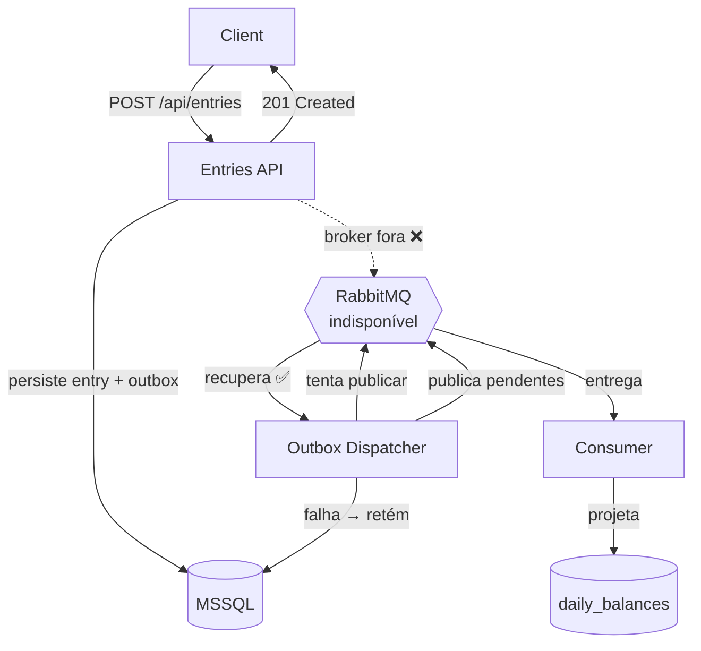
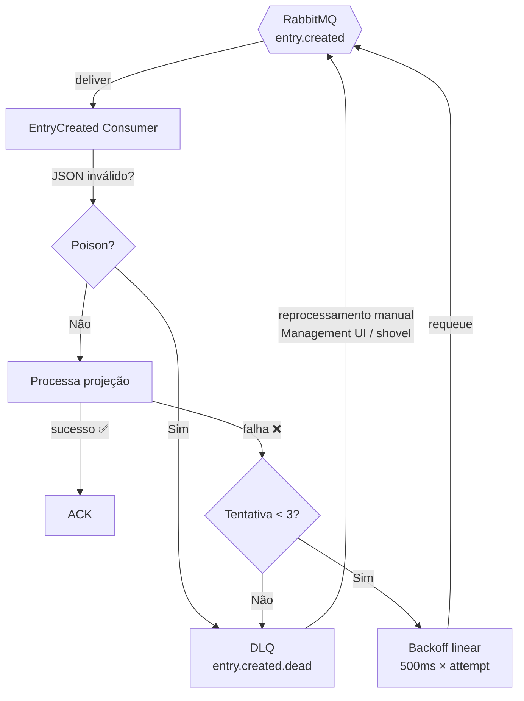

# Verity CashFlow — Sistema de Fluxo de Caixa

Sistema de fluxo de caixa para lojistas: registro de créditos/débitos e saldo diário
consolidado. Duas aplicações desacopladas por mensageria (RabbitMQ) com banco único
compartilhado (MSSQL).

## Arquitetura

O sistema é composto por dois serviços independentes que se comunicam exclusivamente
por mensageria, garantindo resiliência e desacoplamento:

- **Entries API** (:8080) — registra lançamentos (crédito/débito) e publica eventos de
  integração via padrão Outbox transacional.
- **Consolidation API** (:8081) — consome eventos, projeta saldos diários e expõe o
  relatório consolidado.

```
src/
├── Verity.CashFlow.Domain/                      # Entities, VOs, Results (zero dependências)
├── Verity.CashFlow.Application/                 # Casos de uso, ports, IntegrationEvents
├── Verity.CashFlow.Infrastructure.Persistence/  # Dapper, MSSQL (CashFlowDb)
├── Verity.CashFlow.Infrastructure.Messaging/    # RabbitMQ: outbox dispatcher, publisher, consumer
├── Verity.CashFlow.Entries.Api/                 # :8080 — lançamentos
└── Verity.CashFlow.Consolidation.Api/           # :8081 — saldo consolidado
```

**Dependências:** `Api(s) → Persistence/Messaging → Application → Domain` (aciclo).

### Fluxo principal

```mermaid
flowchart LR
    Client -->|POST /api/entries| Entries[Entries API :8080]
    Entries -->|transação única| DB[(MSSQL\nentries + outbox)]
    Entries -->|201 Created| Client

    Dispatcher[Outbox Dispatcher\n2s polling] -->|lê pendentes| DB
    Dispatcher -->|publisher confirms| RabbitMQ{{RabbitMQ\nentry.created}}

    Consumer[EntryCreated Consumer\nprefetch 10] -->|consome| RabbitMQ
    Consumer -->|projeção idempotente\nMERGE| DB2[(MSSQL\nprocessed_entries\ndaily_balances)]

    Client2[Client] -->|GET /api/consolidated/{date}| Consolidation[Consolidation API :8081]
    Consolidation -->|lê daily_balances| DB2
    Consolidation -->|200 JSON| Client2
```

### Fluxo de resiliência (broker indisponível)



### Fluxo de retry e DLQ



## Stack

| Camada | Tecnologia |
|---|---|
| Runtime | .NET 10, C# |
| Data access | Dapper (SQL explícito) |
| Banco | Microsoft SQL Server 2022 |
| Mensageria | RabbitMQ 3 (client v7 async) |
| Containers | Docker, docker-compose |
| Documentação | OpenAPI, Swagger UI, Scalar UI |
| Testes | xUnit, NSubstitute, Shouldly, Testcontainers |

## Pré-requisitos

- **Docker Desktop** — necessário para rodar via docker-compose e para os testes de
  integração (Testcontainers).
- **.NET 10 SDK** — apenas para desenvolvimento local sem Docker.

## Como rodar

### Com Docker (recomendado)

```powershell
docker compose up -d --build
```

Isso sobe 4 containers (MSSQL, RabbitMQ, Entries API, Consolidation API) com healthchecks
e dependências ordenadas. Aguardar até todos ficarem saudáveis (~30s na primeira vez).

Verificar saúde:

```powershell
Invoke-RestMethod http://localhost:8080/health
Invoke-RestMethod http://localhost:8081/health
```

RabbitMQ Management UI: `http://localhost:15672` (usuário: `verity`, senha:
`VerityRabbitMq2026`).

Documentação interativa (apenas em ambiente de desenvolvimento):

| UI | Entries API | Consolidation API |
|---|---|---|
| Swagger | `http://localhost:8080/swagger` | `http://localhost:8081/swagger` |
| Scalar | `http://localhost:8080/scalar/v1` | `http://localhost:8081/scalar/v1` |
| OpenAPI JSON | `http://localhost:8080/openapi/v1.json` | `http://localhost:8081/openapi/v1.json` |

> Swagger/Scalar são mapeados em qualquer ambiente que **não seja Production**
> (inclui `Development` e `Testing`).

Exemplo de uso (curl):

```bash
# Registrar crédito
curl -X POST http://localhost:8080/api/entries \
  -H "Content-Type: application/json" \
  -d '{"amount": 150.75, "type": "Credit", "description": "Cash sale"}'

# Registrar débito
curl -X POST http://localhost:8080/api/entries \
  -H "Content-Type: application/json" \
  -d '{"amount": 30.00, "type": "Debit", "description": "Pagamento fornecedor"}'

# Buscar por ID
curl http://localhost:8080/api/entries/{id}

# Listar por data (paginado)
curl "http://localhost:8080/api/entries?date=2026-08-28&page=1&pageSize=20"

# Saldo consolidado (aguardar ~5s para a consolidação assíncrona)
curl http://localhost:8081/api/consolidated/2026-08-28
```

Parar:

```powershell
docker compose down
```

### Sem Docker (dev local)

Necessário MSSQL e RabbitMQ acessíveis. Configurar connection string e RabbitMq em
`src/Verity.CashFlow.Entries.Api/appsettings.json` e
`src/Verity.CashFlow.Consolidation.Api/appsettings.json`.

```powershell
dotnet run --project src/Verity.CashFlow.Entries.Api
dotnet run --project src/Verity.CashFlow.Consolidation.Api
```

## Como funciona

1. **POST /api/entries** — a Entries API valida o lançamento, persiste entrada + evento
   outbox em uma única transação e retorna 201 (mesmo com broker fora).
2. **Outbox Dispatcher** — BackgroundService que a cada 2s publica eventos pendentes no
   RabbitMQ com publisher confirms e marca como processados.
3. **EntryCreated Consumer** — BackgroundService na Consolidation que consome eventos com
   prefetch 10, tenta até 3 vezes com backoff linear, e na falha envia para DLQ.
4. **Projeção** — insere em `processed_entries` (idempotência por EntryId) e atualiza
   `daily_balances` (MERGE) na mesma transação.
5. **GET /api/consolidated/{date}** — retorna totais de créditos/débitos, saldo do dia e
   saldo acumulado. Dia sem dados retorna zeros (200, não 404).

### Cenários de falha

| Cenário | Comportamento |
|---|---|
| Broker fora | POST retorna 201; evento fica retido no outbox; dispatcher publica ao recuperar |
| Consolidation fora | Broker bufferiza mensagens; consumer reconsome ao reiniciar |
| Poison message (JSON inválido) | DLQ imediata sem retry |
| Falha de projeção (3×) | DLQ após 3 tentativas com backoff |
| Reprocessamento da DLQ | Manual via RabbitMQ Management UI ou shovel |

## APIs

| Método | Endpoint | Descrição |
|---|---|---|
| POST | `/api/entries` | Registra um lançamento |
| GET | `/api/entries/{id}` | Busca lançamento por ID |
| GET | `/api/entries?date=yyyy-MM-dd&page=1&pageSize=20` | Lista lançamentos por data |
| GET | `/api/consolidated/{date}` | Saldo consolidado do dia |
| GET | `/health` | Liveness probe (ambas APIs) |

### POST /api/entries

```json
{
  "amount": 150.75,
  "type": "Credit",
  "description": "Cash sale",
  "occurredAtUtc": "2026-08-26T10:00:00Z"
}
```

`occurredAtUtc` é opcional (default: data/hora local atual). `type`: `"Credit"` ou
`"Debit"`.

### Resposta 201

```json
{
  "id": "guid",
  "amount": 150.75,
  "type": "Credit",
  "description": "Cash sale",
  "occurredAtUtc": "2026-08-26T10:00:00Z",
  "createdAtUtc": "2026-08-26T12:00:00Z"
}
```

### Erros de domínio (400/404)

```json
{
  "title": "Entry validation failed.",
  "status": 400,
  "errorCode": "AMOUNT_MUST_BE_POSITIVE",
  "detail": "Entry amount must be greater than zero."
}
```

## Testes

```powershell
dotnet test Verity.CashFlow.sln
```

- **Unitários** (44 testes): rodam sem Docker — xUnit + NSubstitute + Shouldly.
- **Integração** (17 testes): exigem Docker (Testcontainers sobe MSSQL + RabbitMQ reais);
  auto-skip sem Docker (`[DockerRequiredFact]`).

Total: **61 testes**, todos verdes.

Só unitários:

```powershell
dotnet test tests/Verity.CashFlow.UnitTests
```

| Projeto | Conteúdo |
|---|---|
| `tests/Verity.CashFlow.UnitTests` | Domain, Application, Messaging |
| `tests/Verity.CashFlow.IntegrationTests` | Endpoints, E2E, Resiliência, Documentação (Swagger/Scalar/OpenAPI) |

## Decisões técnicas

| Tema | Decisão |
|---|---|
| Arquitetura | Clean Architecture: `Domain` + `Application` compartilhados; 2 APIs isoladas |
| Data access | Dapper (SQL explícito, sem ORM) |
| Banco | 1 MSSQL (CashFlowDb, 4 tabelas com isolamento lógico por módulo) |
| Mensageria | RabbitMQ com Outbox transacional (zero perda), consumer retry ×3 + DLQ + idempotência |
| Resultados | Padrão `Result<T>` caseiro no Domain — falhas esperadas não usam exceções |
| Estilo | SOLID com referência [EduardoPires/SOLID](https://github.com/EduardoPires/SOLID) |
| Testes | xUnit + NSubstitute + Shouldly; Testcontainers para integração; TDD |
| Documentação | OpenAPI + Swagger UI + Scalar UI |

## Melhorias futuras

- Autenticação (API key / JWT)
- OpenTelemetry + métricas (Prometheus/Grafana)
- CI/CD (GitHub Actions)
- Contagem de tentativas por mensagem no outbox
- Shovel/reprocessamento automático da DLQ
- Migração de schema (Flyway/DbUp)
- Idempotência no POST (chave de cliente)
- Rate limiting
- Split do banco único em 2 bancos por módulo

## Sobre o desafio

### Requisitos atendidos

- [x] API de lançamentos (POST, GET por ID, GET por data)
- [x] API de saldo consolidado por dia
- [x] Consolidado processado assincronamente
- [x] Dia sem dados retorna zeros (não erro)
- [x] Arquitetura desacoplada com mensageria
- [x] Resiliência: POST retorna 201 mesmo com broker fora
- [x] Zero perda de eventos (outbox transacional)

### Requisitos opcionais contemplados

- [x] Mensageria (RabbitMQ com DLX/DLQ, publisher confirms, prefetch)
- [x] Containers (Docker + docker-compose)
- [x] Documentação interativa (Swagger UI + Scalar UI + OpenAPI)
- [x] Diagramas de arquitetura (mermaid)
- [x] TDD (testes unitários + integração com Testcontainers)
