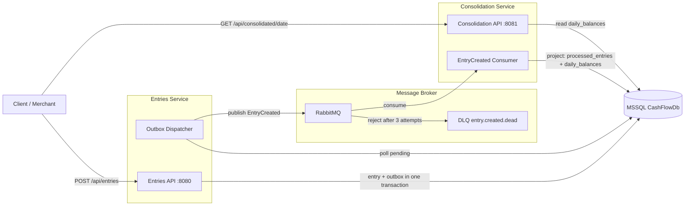
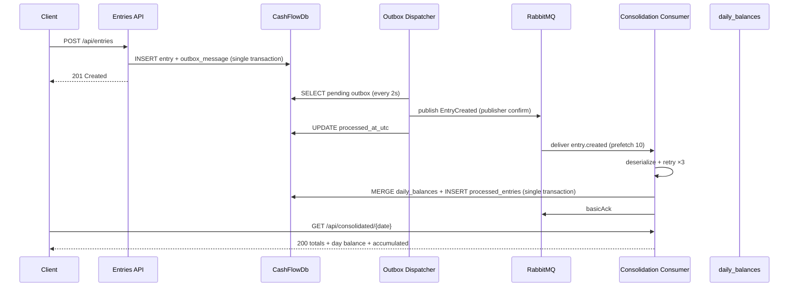
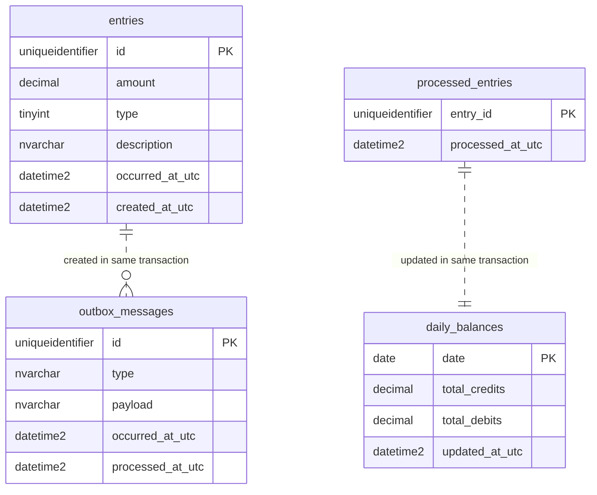

# Arquitetura

## Contexto

O sistema atende lojistas que precisam registrar entradas e saídas de caixa e consultar
o saldo consolidado por dia. Dois serviços independentes expõem APIs HTTP e se comunicam
por mensageria, garantindo que o registro de lançamentos nunca falhe por indisponibilidade
do serviço de consolidação ou do broker.

## Containers

## Fluxo de mensagens

## Modelo de dados (ERD)

## Resiliência

- **Broker fora**: o POST retorna 201; o evento fica retido em `outbox_messages`
  (processed_at_utc IS NULL). O dispatcher tenta publicar a cada 2s e loga erros sem
  derrubar o worker. Ao recuperar o broker, as mensagens são publicadas.
- **Poison message** (JSON inválido): enviada imediatamente para a DLQ
  (`entry.created.dead`) sem retry nem projeção.
- **Falha de projeção** (3 tentativas): após 3 tentativas com backoff linear, a mensagem
  vai para a DLQ. As tentativas anteriores que falham não causam projeção parcial
  (transação rollback).
- **Consolidação fora**: o broker bufferiza as mensagens (unacked volta para a fila).
  Quando a Consolidation reinicia, o consumer reconsome.
- **Reprocessamento da DLQ**: manual via RabbitMQ Management UI ou shovel
  (`rabbitmqadmin` / CLI).
