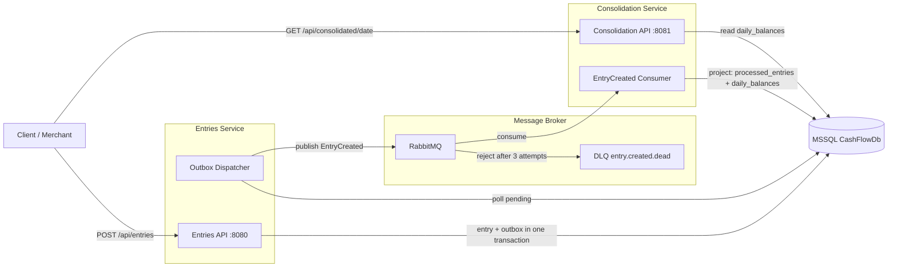
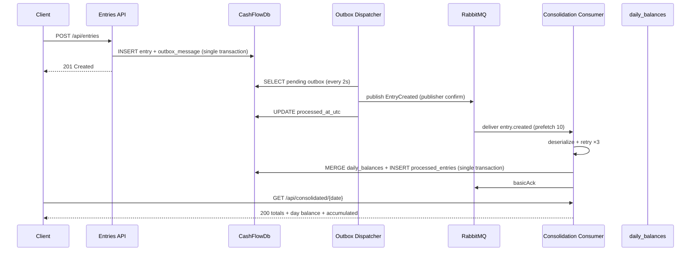
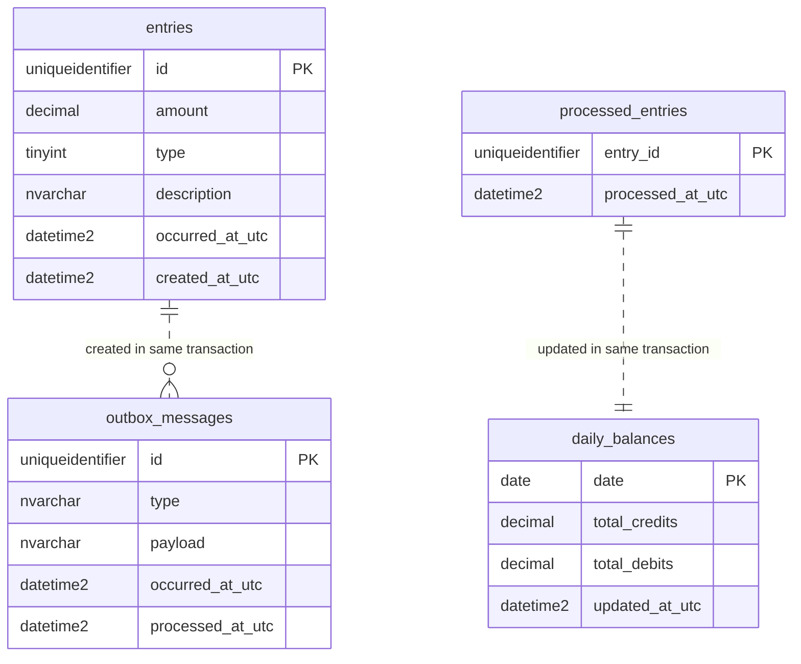

# Wave 8 — Docker e Documentação

## Objetivo

Empacotar a solução (docker-compose com 2 APIs + 1 MSSQL + RabbitMQ, Dockerfiles
multi-stage) e escrever a documentação final em pt-BR: README, arquitetura (diagramas
mermaid) e 9 ADRs. Os testes de integração da onda 7 continuam como verificação.

## Pré-requisitos

- Ondas 1–7 concluídas (testes verdes com Docker).
- `contracts.md` (portas, credenciais, topologia) como referência dos arquivos de infra.

## Arquivos a criar

| Arquivo | Tipo |
|---|---|
| `src/Verity.CashFlow.Entries.Api/Dockerfile` | Código completo |
| `src/Verity.CashFlow.Consolidation.Api/Dockerfile` | Código completo |
| `docker-compose.yml` | Código completo |
| `README.md` | Documento pt-BR (estrutura abaixo) |
| `docs/arquitetura.md` | Diagramas mermaid (conteúdo abaixo) |
| `docs/adr/ADR-0001..0009-*.md` | 9 ADRs pt-BR (conteúdo abaixo) |

## Dockerfiles

### src/Verity.CashFlow.Entries.Api/Dockerfile

(build context = raiz do repo; mesmo padrão para a Consolidation, trocando o projeto)

```dockerfile
FROM mcr.microsoft.com/dotnet/sdk:10.0 AS build
WORKDIR /src

COPY ["src/Verity.CashFlow.Domain/Verity.CashFlow.Domain.csproj", "src/Verity.CashFlow.Domain/"]
COPY ["src/Verity.CashFlow.Application/Verity.CashFlow.Application.csproj", "src/Verity.CashFlow.Application/"]
COPY ["src/Verity.CashFlow.Infrastructure.Persistence/Verity.CashFlow.Infrastructure.Persistence.csproj", "src/Verity.CashFlow.Infrastructure.Persistence/"]
COPY ["src/Verity.CashFlow.Infrastructure.Messaging/Verity.CashFlow.Infrastructure.Messaging.csproj", "src/Verity.CashFlow.Infrastructure.Messaging/"]
COPY ["src/Verity.CashFlow.Entries.Api/Verity.CashFlow.Entries.Api.csproj", "src/Verity.CashFlow.Entries.Api/"]
RUN dotnet restore "src/Verity.CashFlow.Entries.Api/Verity.CashFlow.Entries.Api.csproj"

COPY . .
RUN dotnet publish "src/Verity.CashFlow.Entries.Api/Verity.CashFlow.Entries.Api.csproj" \
    -c Release \
    -o /app/publish \
    /p:UseAppHost=false

FROM mcr.microsoft.com/dotnet/aspnet:10.0 AS runtime
WORKDIR /app

RUN apt-get update \
    && apt-get install -y --no-install-recommends curl \
    && rm -rf /var/lib/apt/lists/*

COPY --from=build /app/publish .
EXPOSE 8080

ENTRYPOINT ["dotnet", "Verity.CashFlow.Entries.Api.dll"]
```

### src/Verity.CashFlow.Consolidation.Api/Dockerfile

Mesmo Dockerfile trocando: os 5 `COPY` de csproj (Consolidation.Api no lugar de
Entries.Api), os caminhos de restore/publish, `EXPOSE 8081` e o `ENTRYPOINT` para
`Verity.CashFlow.Consolidation.Api.dll`.

## docker-compose.yml (raiz do repo — 4 serviços)

```yaml
services:
  mssql:
    image: mcr.microsoft.com/mssql/server:2022-latest
    container_name: mssql
    environment:
      ACCEPT_EULA: "Y"
      MSSQL_SA_PASSWORD: "Verity!CashFlow2026"
    ports:
      - "1433:1433"
    healthcheck:
      test: ["CMD-SHELL", "/opt/mssql-tools18/bin/sqlcmd -S localhost -U sa -P 'Verity!CashFlow2026' -C -Q 'SELECT 1' || exit 1"]
      interval: 10s
      timeout: 5s
      retries: 10
      start_period: 30s

  rabbitmq:
    image: rabbitmq:3-management
    container_name: rabbitmq
    environment:
      RABBITMQ_DEFAULT_USER: "verity"
      RABBITMQ_DEFAULT_PASS: "VerityRabbitMq2026"
    ports:
      - "5672:5672"
      - "15672:15672"
    healthcheck:
      test: ["CMD", "rabbitmq-diagnostics", "-q", "ping"]
      interval: 10s
      timeout: 10s
      retries: 10
      start_period: 20s

  entries-api:
    build:
      context: .
      dockerfile: src/Verity.CashFlow.Entries.Api/Dockerfile
    container_name: entries-api
    ports:
      - "8080:8080"
    environment:
      ASPNETCORE_ENVIRONMENT: "Production"
      ASPNETCORE_URLS: "http://+:8080"
      ConnectionStrings__CashFlowDatabase: "Server=mssql;Database=CashFlowDb;User Id=sa;Password=Verity!CashFlow2026;TrustServerCertificate=True"
      RabbitMq__HostName: "rabbitmq"
      RabbitMq__Port: "5672"
      RabbitMq__UserName: "verity"
      RabbitMq__Password: "VerityRabbitMq2026"
    depends_on:
      mssql:
        condition: service_healthy
      rabbitmq:
        condition: service_healthy

  consolidation-api:
    build:
      context: .
      dockerfile: src/Verity.CashFlow.Consolidation.Api/Dockerfile
    container_name: consolidation-api
    ports:
      - "8081:8081"
    environment:
      ASPNETCORE_ENVIRONMENT: "Production"
      ASPNETCORE_URLS: "http://+:8081"
      ConnectionStrings__CashFlowDatabase: "Server=mssql;Database=CashFlowDb;User Id=sa;Password=Verity!CashFlow2026;TrustServerCertificate=True"
      RabbitMq__HostName: "rabbitmq"
      RabbitMq__Port: "5672"
      RabbitMq__UserName: "verity"
      RabbitMq__Password: "VerityRabbitMq2026"
    depends_on:
      mssql:
        condition: service_healthy
      rabbitmq:
        condition: service_healthy
```

## README.md (pt-BR — estrutura e conteúdo essencial)

Seções na ordem (texto completo redigido na execução da onda, com os elementos abaixo):

1. **Título e visão geral** — sistema de fluxo de caixa para lojista: registro de
   créditos/débitos + saldo diário consolidado; duas aplicações desacopladas por
   mensageria com banco único compartilhado.
2. **Arquitetura** — resumo em texto + diagrama mermaid (ver `docs/arquitetura.md`) +
   link para ADRs.
3. **Stack** — .NET 10, C#, Dapper, MSSQL 2022, RabbitMQ 3, Docker, xUnit/NSubstitute/Shouldly,
   Testcontainers.
4. **Pré-requisitos** — Docker Desktop; .NET 10 SDK (apenas para desenvolvimento local).
5. **Como rodar** —
   `docker compose up -d --build`; verificar `http://localhost:8080/health`,
   `http://localhost:8081/health`, RabbitMQ UI `http://localhost:15672`
   (verity/VerityRabbitMq2026); exemplo de `POST` + `GET` com `Invoke-RestMethod`;
   como parar (`docker compose down`; volumes anônimos são descartados).
   Subseção "sem Docker" (dev local): RabbitMQ próprio + connection string no
   `appsettings.json`, `dotnet run --project src/Verity.CashFlow.Entries.Api` +
   `dotnet run --project src/Verity.CashFlow.Consolidation.Api`.
6. **Como funciona** — fluxo do lançamento (transação entrada+outbox → dispatcher →
   RabbitMQ → consumer → projeção → relatório); o que acontece em cada falha
   (broker fora, consolidação fora, poison message → DLQ e reprocessamento manual
   via management UI).
7. **APIs** — tabela de endpoints (ver `contracts.md` seção 6) + payloads de exemplo.
8. **Testes** — `dotnet test` (unit + integração; integração exige Docker, auto-skip);
   como rodar só unitários; onde ficam os projetos.
9. **Decisões técnicas** — tabela resumo dos 9 ADRs com links.
10. **Melhorias futuras** — auth/API key, OpenTelemetry + métricas, CI/CD (GitHub
    Actions), contagem de tentativas por mensagem no outbox, shovel/reprocessamento
    automático da DLQ, migração de schema (Flyway/DbUp), idempotência no POST
    (chave de cliente), rate limiting, split do banco único em 2 bancos por módulo.
11. **Sobre o desafio** — requisitos atendidos (checklist) e requisitos opcionais
    contemplados (mensageria, containers, diagramas).

## docs/arquitetura.md — diagramas (conteúdo completo)

```markdown
# Arquitetura

## Contexto
[diagrama de contexto: lojista/cliente HTTP → Entries API / Consolidation API]

## Containers
[diagrama de containers: 2 APIs, MSSQL único (CashFlowDb), RabbitMQ, workers]

## Fluxo de mensagens
[sequência: POST → outbox → dispatcher → RabbitMQ → consumer → projeção]

## Modelo de dados (ERD)
[4 tabelas: entries, outbox_messages | processed_entries, daily_balances]

## Resiliência
[fluxos alternativos: broker fora (outbox retém), poison message → DLQ,
 consolidação fora (broker bufferiza)]
```

**Diagrama de containers (mermaid):**



**Sequência do fluxo (mermaid):**



**ERD (mermaid):**



## ADRs (docs/adr/ — 9 arquivos pt-BR)

Formato de cada ADR: **Status** (Aceito) / **Contexto** / **Decisão** / **Alternativas
consideradas** / **Consequências** (prós e contras).

| ADR | Título | Essência da decisão |
|---|---|---|
| `ADR-0001-duas-apis-camadas-compartilhadas.md` | Duas APIs com camadas compartilhadas | Cada requisito de negócio do desafio ("uma aplicação de lançamentos" e "uma de saldo") vira um serviço/processo independente; Domain/Application/Persistence/Messaging são bibliotecas compartilhadas — cada API registra só o que usa; isolamento de deploy e falha entre os processos |
| `ADR-0002-dapper-data-access.md` | Dapper como data access | Micro-ORM com SQL explícito: performance, controle do MERGE/paginação e proximidade do desafio; alternativa EF Core rejeitada pelo peso/abstração |
| `ADR-0003-banco-unico-por-modulo.md` | Banco único com tabelas por módulo | 1 MSSQL (CashFlowDb) com isolamento lógico (entries/outbox ⊥ processed/daily); resiliência garantida pela mensageria (NFR é sobre consolidação, não banco); split futuro viável sem mudança de código de domínio; trade-off do ponto único de falha documentado com mitigação |
| `ADR-0004-rabbitmq-mensageria.md` | RabbitMQ na integração | Requisito opcional de mensageria; DLX/DLQ nativos, prefetch, publisher confirms; alternativa Kafka descartada (peso); **API v7 async validada na doc oficial** |
| `ADR-0005-outbox-transacional.md` | Padrão Outbox transacional | Garante zero perda: evento e entrada na mesma transação; dispatcher BackgroundService com polling de 2s; sem UoW explícito — atomicidade como operação única do port `IEntryStore` |
| `ADR-0006-resiliencia-retry-dlq-idempotencia.md` | Retry, DLQ e idempotência | 3 tentativas com backoff linear; poison → DLQ; idempotência por EntryId transacional; alvo 50 req/s superado por desacoplamento + broker como buffer (perda 0%, tolerância do desafio é ≤5%) |
| `ADR-0007-estrategia-testes.md` | Estratégia de testes | TDD por ondas; unit com NSubstitute + Shouldly (BSD-3, mensagens descritivas — FluentAssertions excluído por licença); integração com Testcontainers reais (MSSQL+RabbitMQ) e auto-skip sem Docker; WebApplicationFactory |
| `ADR-0008-solid-referencia-epires.md` | SOLID com referência EP.SOLID | Mapeamento dos 5 princípios (ver convenções seção 8); por que a referência didática do Eduardo Pires foi adotada como guia de estilo |
| `ADR-0009-padroes-de-resultado.md` | Padrão Result<T> caseiro | Falhas esperadas como valores (`Result`/`Result<T>`/`Error` no Domain), exceções só para o inesperado; implementação própria (~60 linhas, zero dependências) vs ErrorOr/FluentResults; endpoints mapeiam `Error.Code` → ProblemDetails |

## Comandos de verificação

```powershell
docker compose build
docker compose up -d
docker compose ps
Invoke-RestMethod http://localhost:8080/health
Invoke-RestMethod http://localhost:8081/health

$body = '{"amount": 150.75, "type": "Credit", "description": "Cash sale"}'
Invoke-RestMethod -Method Post -Uri http://localhost:8080/api/entries -ContentType "application/json" -Body $body
Invoke-RestMethod http://localhost:8081/api/consolidated/2026-08-26

dotnet test Verity.CashFlow.sln
docker compose down
```

## Critérios de aceite

1. `docker compose up` sobe os 4 containers healthy; POST flui até o relatório
   consolidado (verificado manualmente com os comandos acima).
2. APIs continuam respondendo com RabbitMQ parado (`docker compose stop rabbitmq` →
   POST ainda retorna 201; mensagens ficam retidas no outbox; ao religar o broker o
   dispatcher publica e a DLQ acumula o que falhar após reinício).
3. README completo em pt-BR: qualquer pessoa roda o projeto seguindo apenas ele.
4. 9 ADRs + arquitetura com diagramas renderizáveis no GitHub.
5. `dotnet test` verde (integração incluída, com Docker ativo).

## Notas / riscos

- Senhas no compose são de demonstração — documento no README que produção usaria
  secrets (Docker secrets/KeyVault) — citado também em melhorias futuras.
- `curl` instalado no runtime stage apenas para eventual depuração (healthchecks do
  compose usam comandos nativos das imagens).
- RabbitMQ `guest` não funciona entre containers (restrição de localhost do broker) —
  por isso o usuário `verity` no compose (detalhe no README e contracts).
- Build context único na raiz: `docker compose build` restaura por camadas de csproj
  (cache eficiente).
- Diagramas mermaid renderizam nativamente no GitHub — sem ferramenta externa.
